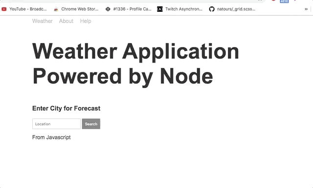

# Weather Applicaiton

## Description 

This is a weather application that is powered by Node.js on the backend. Instead of making an AJAX call on the front end to then be blocked by the CORS policy. We instead use the NPM package "request" to make a GET request to two API endpoints which returns forecast and geolocation data.

We then send JSON data back to our weather endpoint.

On the client side the user calls the forecast data from our created API endpoint and appends the info plus our sentence to the DOM.

## Code Snippet

```javascript
//Found in app.js
    geocode(req.query.address, (error, {latitude, longitude, location} = {}) => {
        if (error){
            res.send({error})
        }
// FOund in utils/geocode.js

        const geocode = (address, callback) => {

    const url = 'https://api.mapbox.com/geocoding/v5/mapbox.places/' + address +'.json?access_token=pk.eyJ1Ijoiem9vdGVjaGRydW0iLCJhIjoiY2sxempuZm5uMHlzZjNjcW9ycnk1MmxlOSJ9._p2DgJbnQSzpFa7GmlWkOQ'

    //'https://api.mapbox.com/geocoding/v5/mapbox.places/' + address + '.json?access_token=pk.eyJ1Ijoiem9vdGVjaGRydW0iLCJhIjoiY2sxempuZm5uMHlzZjNjcW9ycnk1MmxlOSJ9._p2DgJbnQSzpFa7GmlWkOQ'

    request({ url, json: true }, (error, { body }) => {
        if (error) {
            callback('Unable to connect to location services!', undefined)
        } else if (body.features.length === 0) {
            callback('Unable to find location. Try another search.', undefined)
        } else {
            callback(undefined, {
                latitude: body.features[0].center[1],
                longitude: body.features[0].center[0],
                location: body.features[0]
            })
        }
    })
}
```

The above code shows how we use the callback function in the geocode file
and the use destrucuring in app.js file to get the params we get from geocode file. 

we then use those params for the forecast file and to send back to the API endpoint.

## What the project actually looks like 




